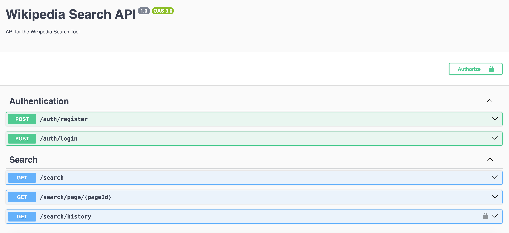

# Wikipedia Search and Analysis Tool - Backend

This is the backend server for the Wikipedia Search and Analysis Tool, built with Nest.js.

## Project Overview

The backend server manages Wikipedia API interactions from multiple users, emphasizing performance and secure interactions and also provides API's for basic authentication of user.

## Features

- **Basic Auth:** Added API's for authenticating user, using basic auth and persisting the user records in Postgres DB
- **Search Results:** Provided paginated API's to Process and serve search results from the Wikipedia API.
- **Search History:** Keeping track of user search history and persisting the same in DB. Also provided paginated API's for fetching the same.
- **Page Content:** Get the page content of wikipedia search

## Setup Instructions

1. Clone the backend repository:

   ```bash
   git clone git@github.com:maaizelahi/wikipedia-search-service.git
   cd wikipedia-search-service
   ```

2. Install dependencies:

   ```bash
   npm install
   ```

3. Set up environment variables (refer to .env.example).
4. Set up PostgreSQL database:
   []Create a PostgreSQL database.
   []Update the .env file with your PostgreSQL connection details.

   ```bash
   DB_HOST=your_postgres_host
   DB_PORT=your_postgres_port
   DB_USER=your_postgres_user
   DB_PASSWORD=your_postgres_password
   DB_NAME=your_postgres_database
   ```

5. Run the server:

   ```bash
   npm start
   ```

   The server will be running on http://localhost:3333 by default.

6. Accessing API Swagger Docs

   ```bash
   http://localhost:3333/docs
   ```



## Project Structure

- src/main.ts: Entry file.
- src/app.module.ts: Main module.
- src/modules: Contains other modules such as auth and search. Modules have controller, service, entities, dtos encapsulated within thier respective folders.
- src/middleware: Folder holding AuthMiddleware.
- src/helpers: For all the utility functions
- config.ts: Contains all the config values

## Performance Optimization

- Paginated API's

## Security

- Added user Authentication
- Doing Request validation
- Have setup http security headers using [helmet](https://docs.nestjs.com/security/helmet)
- Have setup [CORS](https://docs.nestjs.com/security/cors)
- Storing hashed password using bcrypt
- Have introduced ratelimiting to prevent DDos
- Implement clear and consistent error messages to avoid exposing internal details or stack traces
- Expiring auth token after sometime

## Testing

```bash
npm run test
npm run test:cov
npm run test:e2e
```

Test case need to be added

## Author

Maaiz Elahi
